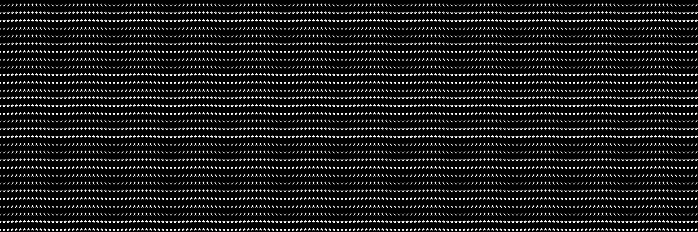

**SJSU ART 101 Fall 2026 Section 1**
======================
Department of Art and Art History
Art 101, Fall 2026

Instructor: Andrew Blanton
Office: Art 311
Email: andrew.blanton@sjsu.edu
Office Hours: T TR 11-12
Class Day/Time: TR 12:00-2:50
Class Website: https://github.com/SJSU-CADRE-CLASSES/SJSU_Art_101_F26_01

[GreenSheet](https://github.com/SJSU-CADRE-CLASSES/SJSU_Art_101_F26_01/blob/main/GREENSHEET.md)
| [Resources](https://github.com/SJSU-CADRE-CLASSES/SJSU_Art_101_F26_01/blob/main/RESOURCES.md)
| [Teams](https://github.com/SJSU-CADRE-CLASSES/SJSU_Art_101_F26_01/tree/main/teams)
| [Class Website](https://github.com/SJSU-CADRE-CLASSES/SJSU_Art_101_F26_01)

Examples (Boru)
---------------
- [JavaScript From Zero](https://sjsu-cadre-classes.github.io/SJSU_Art_101_F26_01/Examples/JavaScript_Teaching_Script_and_Examples.html)
- [JavaScript Functions Lab](https://sjsu-cadre-classes.github.io/SJSU_Art_101_F26_01/Examples/JavaScript_Functions_Student_Reference.html)
